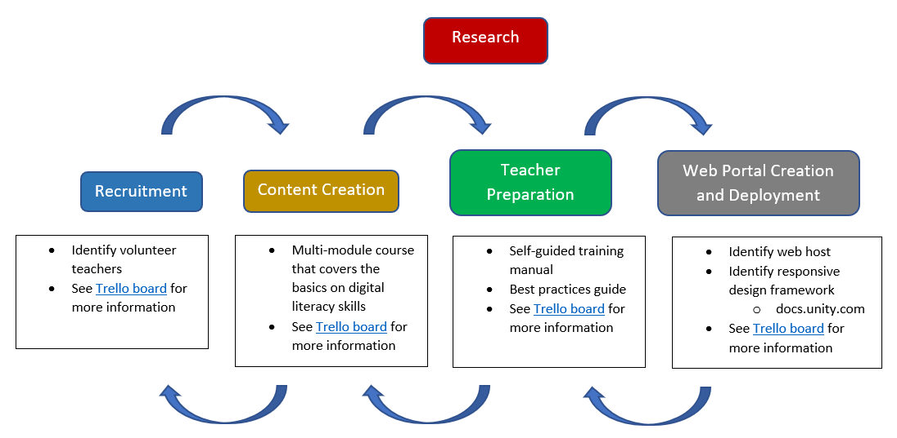
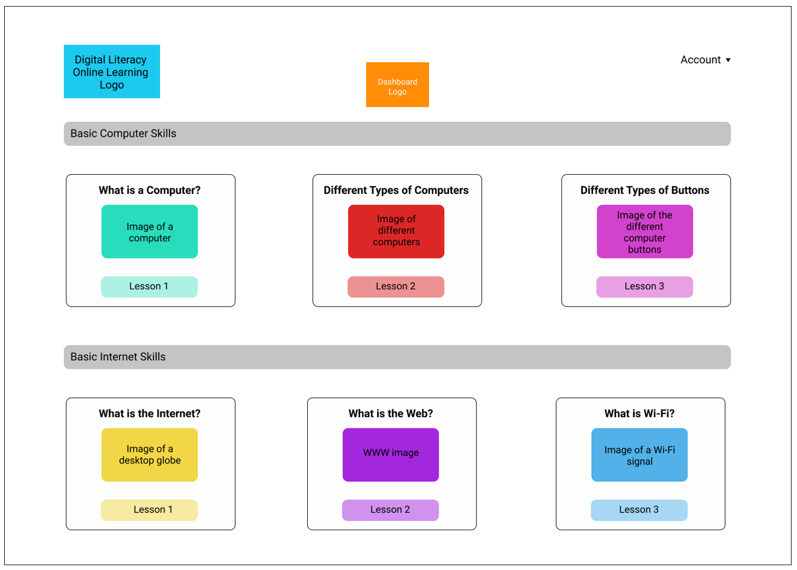

## Digital Literacy Skills Course

<iframe src="https://docs.google.com/presentation/d/e/2PACX-1vQTbTW6cpLpzgkfYm54gzYXiIiBn52XSL3r6RVcTz5GXkuUKe2xCg9x9FUWyLihXA745Mbm-qSCWyAe/embed?start=true&loop=true&delayms=3000" frameborder="0" width="960" height="569" allowfullscreen="true" mozallowfullscreen="true" webkitallowfullscreen="true"></iframe>

## Team

Giovani Galicia: Research, content creation, PM and web development

Jeff Savin: Research, content creation, web development

Sheila Foley: Research, content creation, web development

Andrew Domzalski: Research, content creation, user evaluations

### Partner Organization

The Centro de Formación Integral LaSalle, A.C. de Tijuana, B. C. is a volunteer-run, community school that offers free social and educational programs to low-income communities. More than 150 courses (formative and technical) are taught in addition to participating in the promotion of free Middle School and High School. With this, it is sought that the student who attends the Center receives a formative and technical education so that his educational growth is comprehensive and complete.

### Partner organization’s needs and challenges

The school is currently unable to provide sufficient digital literacy skills classes to all students, due to the lack of digital literacy volunteer teachers and the lack of digital literacy materials. There is also no teacher training program for the volunteers, who don’t have relevant experience. As a result, many students are unable to enroll in digital literacy classes and are placed on a long wait list.

### Specific needs the C4G team will address

The team will provide a bilingual (English/Spanish) digital literacy skills teacher training program. This will consist of a six-module digital literacy course, a self-guided manual on how to use the digital literacy course in the classroom, and a best practices guide on how to run a digital literacy skills class. This training program will have off-line and web-based options.

### What the solution would look like to the intended users?

Both students and teachers at the center will have access to an off-line and web-based solution, which will consist of a multi-module digital literacy course. Each module will have its own card along with different sections. The sections represent the actual topics of the module.
In terms of functionality, the website may be adapted to work on any screen size. This avoids the need to create a separate mobile application. In addition, the website will have a teacher section where anyone interested in teaching a digital literacy course at the center will get access to the self-guided manual and the best practices guide. Lastly, the teacher training program will have an off-line version. This off-line version will consist of PDF files for the digital literacy course, self-guided manual, and best practices guide.

### Feedback from partner organization and other stakeholders

We plan to elicit feedback from Jorge Guzmán Ramos, the center’s director, and from Shivam at our weekly meetings. In addition, one volunteer teacher has expressed interest in providing suggestions and feedback on our project. We plan to gather the teacher’s feedback on a weekly basis via zoom or via a survey. All feedback will be discussed amongst the team and will be integrated based on the level of difficulty and time required. As the project evolves, we will continue to gather feedback from Jorge, Shivam, and current volunteer teachers via discussions and surveys.

### Plan for development, evaluation, and deployment

The C4G team formulated the project in five main phases: research, recruitment, content creation, teacher preparation, and web portal creation and deployment.

We will first research existing digital literacy skills content, teacher training programs, and classroom best practices guides, incorporating the best ideas from our research, the center’s immediate needs, and Giovani’s experience creating and teaching digital literacy classes at the center in our solution. In the recruitment phase, we will identify volunteer teachers interested in reviewing and taking our proposed teacher training solution.

The content creation phase will consist of researching, selecting and designing a digital literacy skills course, a self-guided training manual and a classroom best practices guide. Our proposed multi-module digital literacy skills course will consist of topics such as, introduction to the computer, internet and email. We will take an iterative approach in this phase, meaning that we will first release an initial module with a certain number of units. This module will be reviewed by the team and then presented to Jorge and the current volunteer teachers. This will allow us to receive feedback, evaluate our approach and iterate again until we have a consistent and well-organized course module. This final module will be our blueprint for the remaining modules.

In the teacher preparation phase, our focus will be on creating a self-guided training manual and a classroom best practices guide. The manual will provide instructions on how to use the digital literacy skills course to the volunteer teacher. The classroom best practice guide will provide advice on how to organize the classroom, the importance of repetition for complex topics, and ways to encourage students to practice what they just learned. We will seek feedback from current volunteer teachers to come up with a useful manual and guide.

Finally, the web portal creation and deployment phase will consist of transferring the digital literacy course, the manual and the guide into a website. This will require us to come up with a simple, responsive and well-organized interface. Our goal is to take an iterative approach in this phase so that we can improve as we receive feedback from Jorge, the current volunteers and Shivam. As a first step, we selected a responsive design in GitHub Pages. We will continue our research to improve on this initial design.

### Design and development choices

One development choice that we have made at this stage is the use of GitHub Pages to fulfill the needs for our website while providing more flexibility versus alternative options such as Wordpress. Regarding the design of the website, we are inspired by the design of Northstar Digital Literacy, a digital literacy program created by Literacy Minnesota. We anticipate using elements of the Northstar designs in our website. Below is an example of a potential landing page for the digital literacy course.

